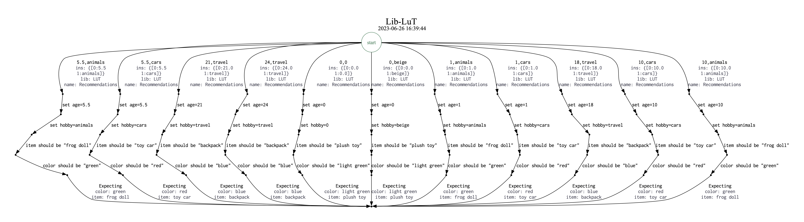

= Lookup Table Library
_Provengo Core Team_

A library for defining lookup tables to your Provengo models.

Lookup tables are a popular way of creating when/then tests, such as:

> When `customer_age` is "8" and `customer_hobby` is "cars", then `recommended_item` should be "red toy car".

This library also allows to definition of ranges of values, as well as generation of test cases based on table rows.

== Example

Consider the test case of a recommendation system for products, based on customer properties.

[cols="1,1,1,1"]
|===
| (in) Age | (in) Hobby | (out) Item | (out) Color

| 0 | n/a | plush toy | light green

| 1-10 | cars | toy car | red 

| 1-10 | animals | frog doll | green

| 18-24 | travel | backpack | blue

| (all) | beige | bicycle | beige

| (all) | (all) | bicycle | white

|===

based on the above table, we expect the system to offer a frog doll when asked to recommend a product for a 7-year old who likes animals, a toy car for a similar kid who likes cars, and a white bicycle for a 13 year old.

The above table is captured in code like so:

[source, javascript]
----
const myLut = LUT.create({                                                                <.>
    name: "Recommendations",
     ins: ["age","hobby"],
    outs: ["item","color"]
});

myLut.addRow({ ins:[0, LUT.ANY                  ], outs:["plush toy", "light green" ]});  <.>
myLut.addRow({ ins:[LUT.Range(1,10),  "cars"    ], outs:["toy car",   "red"         ]});
myLut.addRow({ ins:[LUT.Range(1,10),  "animals" ], outs:["frog doll", "green"       ]});
myLut.addRow({ ins:[LUT.Range(18,24), "travel"  ], outs:["backpack",  "blue"        ]});
myLut.addRow({ ins:[LUT.ANY,          "beige"   ], outs:["bicycle",   "beige"       ]});

myLut.addRow({                                                                            <.>
    ins:{age:LUT.ANY, hobby:"beige"},   
    outs:["bicycle", "white"]
});
myLut.addRow({
    ins:[LUT.ANY, LUT.ANY],
    outs:{item:"bicycle", color:"white"}
});

let useCase = request(myLut.generateLutEvents());                                         <.>
let expected = myLut.lookup(useCase.data.ins);                                            <.>
----
<.> Defining the lookup table: name, input and output column headers
<.> Adding rows using column structure (technically, arrays)
<.> Adding rows using named parameters (technically, objects). Arrays and objects can be used together.
<.> Generating test cases from the lookup table
<.> Looking up expected data

TIP: The full sample code is available in this repository. See xref:data/recommendations.js[table definition] and xref:spec/js/sample-recommendations.js[client code].

.Scenario space generated by the above code

NOTE: Bug reports, suggestions, and pull-requests are very welcome 😀

== In this Repo

This is a standard Provengo project folder, so you can expect the usual file structure. Listed below are files of interest:

xref:data/recommendations.js[]::
    Sample lookup table, shown in the above code;
xref:lib/lut.js[]::
    The library itself. Put this file in your project's `lib/` directory in order to use it.
xref:spec/js/sample-recommendations.js[]::
    A sample client code for this library. Creates test cases based on the lookup table defined in xref:data/recommendations.js[].
xref:meta-spec/book-writer.js[]::
    A manual test book creation script. Uses a method from the library to handle LUT library events.
xref:Reference.adoc[]::
    API Reference of the library.

== Installation

To install, place the library's source file, xref:lib/lut.js[], in the `lib` folder of your project. To download directly from this site, write the following snippet at your project's root directory:

[source, bash]
----
curl https://raw.githubusercontent.com/Provengo/Lib-LuT/main/lib/lut.js > lib/lut.js
----

== Documentation

* xref:Reference.adoc[Library Documentation]
* https://docs.provengo.tech[Provengo's Documentation]
* https://www.youtube.com/@provengo[Provengo's YouTube Channel]
* https://provengo.tech[Provengo's Main Site]

---

Enjoy, and we hope you find it useful!

-- Provengo Engineering